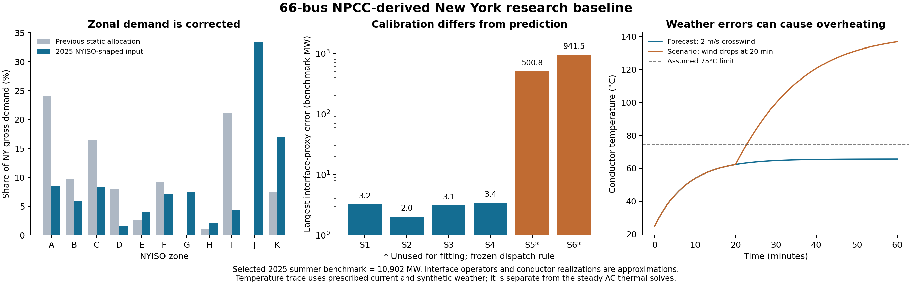

# Compact New York 2025 DLR research baseline

The new preliminary model has **66 New York buses, 125 branch records (112 active), and 37 generator records**. It retains all 46 original NPCC New York bus IDs, stays below the 200-bus ceiling, and represents neighboring systems through ten fixed scheduled injection channels. External NPCC buses remain in the construction for provenance; the operating case contains only New York. The earlier 51-bus benchmark and larger Package A/B artifacts remain separate references.

NYISO zonal demand shares enter the case correctly, and four 2025 operating points closely fit seven interface proxies. Twenty-three explicitly assumed overhead-conductor realizations provide tested electrical/thermal consistency. A [separate independent generation reconstruction](COMPACT_NY_GENERATION_RECONSTRUCTION.md) now tests four new hours without fitting interface targets; mean errors are 134–185 benchmark MW. Complete observed zonal generation remains unavailable. This is an approximate research baseline, not a validated NYISO planning case.

**Infrastructure evidence correction:** [Owner commissioning notices](output/compact_ny_2025/sources/INFRASTRUCTURE_2025_STATUS_AUDIT.md) establish partial Smart Path Connect energization in late 2025. The frozen northern 230-kV templates omit those additions; the earlier blanket post-2025 exclusion was too broad. The 66-bus case represents selected developments, not a complete year-end equipment reconstruction.



## Observations and consistent scale

One scale factor per vintage applies to demand, scheduled exchanges and interface values. The selected summer snapshot is 10,902.2197987 MW: gamma is 0.3586622254 for 2019 and 0.3557586601 for 2025. Other hours retain seasonal demand differences; 2025 spring demand is 3,942.953 MW. These are benchmark-scale powers, not a full-size physical NYISO case.

The former constant-total method inflated each light-load hour to 10.902 GW while equipment limits stayed fixed. It produced a 773.8-MW spring interface error. The consistent fixed-peak scale reduces that error to 3.1 MW without changing equipment or generator bounds. The former campaign remains under `output/compact_ny_2025/electrical_constant_total_diagnostic` for comparison.

The input builder reads public P58C load and P32 interfaces/exchanges, retains actual and scaled values, verifies source hashes against archived ZIP members, and records row/timestamp provenance. Six selected hours per vintage cover summer, winter, spring, high NYC/LI load, and high/low Total East. Twelve hours are not annual statistical coverage.

All active pairs in this preserved calibration campaign use the same published hour label, but hourly load and a five-minute flow sample have unequal averaging intervals. The archived 2025 spring 14:00 load/14:03 flow pair is excluded and explicitly replaced by a common 13:00 pair. The separate independent generation experiment now implements hourly averaging, explicit gap exclusions and timing sensitivity; it does not overwrite these earlier results.

Within each zone, observed scaled gross load uses original positive-load bus weights. G/J previously had no positive demand and now use registered proxy weights. New transit stations add no copied load. Existing Q/P ratios are retained where defined; otherwise load power factor 0.97 is assumed. Gross load and external injections have separate ledgers before forming effective MATPOWER PD/QD.

At the selected 2025 summer hour, J receives **33.383%** of demand and K **16.996%**, compared with 0% and 7.422% in the previous static allocation. The [eleven-zone table](output/compact_ny_2025/figures/summer_peak_zonal_load_comparison.csv) verifies exact scaled accounting. This validates allocation of an input, not a prediction of demand.

External channels are the four primary regions, CSC, 1385, Neptune, VFT, HTP and separate Cedars. Overlapping HQ_IMPORT_EXPORT is retained but excluded from the sum, matching [NYgrid's pinned accounting](https://github.com/AndersonEnergyLab-Cornell/NYgrid/blob/47698b6c7823ae7b1bc6935e5601d5b64b8f918e/updateOpCond.m#L248). A sensitivity replaces HQ-NY with HQ_IMPORT_EXPORT without adding both. Landing locations, allocation splits and zero boundary Q are assumptions. These fixed scheduled injections do not provide dynamic external-system response.

## Infrastructure through the 2025 cutoff

The scenario cutoff is **2025-12-31**. Seasonal 2025 operating conditions are tested on that year-end topology, not claimed as exact equipment reconstructions for every earlier date. Public project evidence and assumed electrical parameters are recorded separately.

| Change | Modeled representation |
|---|---|
| Central East Energy Connect | Princetown/Gordon Road stations, six assumed 345-kV sections, transformer and registered split of the old 230-kV path. [Owner completion evidence](https://www.nypa.gov/news/press-releases/2023/20231213-transmission-line) is dated December 2023. |
| New York Energy Solution | Churchtown inserted into the selected 345-kV corridor; two assumed sections replace an old equivalent. [Owner completion evidence](https://nytransco.com/wp-content/uploads/2023/08/NYES-News-Release.8.16.23_updated.pdf) is separate from parameter templates. |
| Smart Path | Adirondack and four 230-kV historical-template circuits replace an NPCC equivalent. Rebuild resistance changes are assumptions. The partial 345-kV Smart Path Connect additions energized in late 2025 remain an explicit model omission. |
| NYC receiving network | Rainey, East Astoria, Corona, Gowanus, Greenwood and Fox Hills receiving/support paths. Predecessor replacements prevent silent duplication. Cable and transformer rows receive no overhead thermal model. |
| Reliable Clean City | Queens uses completed-project evidence. Brooklyn/Staten Island inclusion originally used the May-2025 announcement; the subsequent owner completion reports provide stronger support. Exact energization days and electrical parameters remain unverified. |
| Later projects | CHPE, RCC Long Island City and Propel NY are excluded at the 2025 cutoff. Smart Path Connect requires component-specific dates; the frozen case omits its partial 2025 additions. |

The overlay adds 15 buses and 33 branch records and retires eight prior records. Stable keys, predecessor dispositions, source templates and rating assumptions accompany every addition. Historical PERFORM workbook values provide parameter templates, not proof of commissioned-project R/X/B. [Eight prespecified S1 sensitivities](output/compact_ny_2025/sensitivities/SENSITIVITY_RESULTS.md) all pass bounded AC and independent PF, with interface MAE 1.970–2.051 MW. They vary impedance, charging, uncertain project status, retirement and wind availability without automatically selecting whichever fits best. These are calibration sensitivities, not new independent validation hours.

Public generation events use the fixed 2025 scale: Cricket Valley 1,100 MW becomes a 391.335-MW P-only proxy; South Fork Wind 132 MW becomes 46.960 MW. Both are carved from existing regional capacity slots. An assumed Astoria retirement removes 187.841 benchmark MW from a generic J slot, corresponding to 528 public MW. No-retirement and zero-wind-availability sensitivities preserve the uncertainty.

There is no explicit Buchanan generator in the compact parent. Indian Point retirement is recorded without a second arbitrary deduction; unknown legacy aggregate composition prevents claiming that all embedded supply has been identified. Remaining finite P/Q bounds are benchmark assumptions. Named new proxies have Qmin=Qmax=0 and add no artificial voltage support.

## Calibration and validation

The [NYgrid paper](https://doi.org/10.1109/TPWRS.2022.3200887) motivates a small NPCC-derived model with public operating data. Its 57-bus model estimates unavailable generation using fossil-unit records, daily nuclear status, monthly hydro and statewide fuel mix. Its DC validation does not establish this model's AC feasibility. The [source audit](output/compact_ny_2025/sources/NYGRID_GENERATION_SOURCE_AUDIT.md) records paper/code differences and available generation evidence.

Bounded AC optimization adjusts dispatch and voltages within fixed declared limits. Training penalizes interface-proxy residuals and departures from declared dispatch priors; exact nonlinear derivatives pass independent checks. Every accepted state then passes separate fixed-input AC power flow and fresh nodal, generator, branch, voltage and accounting audits. No balance slack or fictitious active injection is added.

Seven operators use current branch keys and explicit metering ends: Dysinger East, West Central, Moses South, Central East, partial Total East, six-circuit UPNY/ConEd, and Dunwoodie South. They are **not complete official NYISO flowgate definitions**. Calibration cannot turn a local zone crossing into the full Total East operator.

Four 2025 hours fit interface targets. Their mean normalized generation dispatch is frozen before S5/S6 prediction; unused interface targets enter neither that rule nor its optimizer. All 2019 interface values are scoring-only for the 51-bus reference, which is not a reproduction of the paper's complete 2019 fleet reconstruction.

| 2025 scenario | Interface use | Mean absolute error, benchmark MW | Largest error, benchmark MW |
|---|---|---:|---:|
| S1 summer | Calibration | 2.017 | 3.207 |
| S2 winter | Calibration | 1.180 | 2.028 |
| S3 spring | Calibration | 1.075 | 3.080 |
| S4 NYC/LI | Calibration | 1.995 | 3.431 |
| S5 high Total East | Unused for fitting | 284.37 | 500.85 |
| S6 low Total East | Unused for fitting | 317.06 | 941.51 |

All twelve snapshots pass bounded AC and independent replay. Small calibration errors do not establish unseen-hour dispatch accuracy; [full results](output/compact_ny_2025/electrical_fixed_peak/ELECTRICAL_CALIBRATION_RESULTS.md) retain the prediction errors. Normalized errors flag near-zero targets and use an explicit 100-MW denominator floor.

Public fuel mix is statewide, with no zone field. No complete observed eleven-zone generation series was found in the products checked. Zonal dispatch is therefore **estimated, not independently validated**. Inferring it from the same interfaces used for fitting would be circular. The new [source-only variant](COMPACT_NY_GENERATION_RECONSTRUCTION.md) joins EPA/EIA/NYISO identities, NRC status, capped hydro and renewable estimates with explicit timing, coverage and gross/net reconciliation. The capacity/participation rule described here remains a preserved comparison baseline.

## Assumed conductor and thermal model

Only 23 whitelisted overhead interpretations receive thermal models: eleven selected PERFORM circuits and twelve CEEC/NYES/Smart Path assumptions. Electrical source identity alone does not verify overhead equipment or installed conductor type. Cables, transformers, boundaries and other equivalent branches remain outside this interpretation.

Each selected row is one circuit: two Cardinal 954 ACSR subconductors per phase at 345 kV, or one Drake 795 ACSR at 230 kV. A Hawk template is available for alternatives. Diameter, component mass and AC75 resistance come from the [Priority Wire ACSR catalog](https://www.prioritywire.com/specs/acsr.pdf), April-2026 revision. This is a surrogate catalog, not evidence of installed 2025 NY conductors. Heat capacities, linear resistance slope, surface coefficients 0.8 and a 75°C limit are assumptions.

Assume frozen branch resistance represents AC75. With n_c circuits and n_b subconductors per phase, derive effective length L = R_eq n_c n_b / r_75. Each realization exactly reproduces electrical resistance. Resulting lengths of 4.1–71.7 km are effective quantities, not surveyed routes; they do not identify X/B or geometry. Extreme lengths are blocked pending review.

The lumped heat balance is C dT/dt = I_sub² r(T) + q_solar − q_convection − q_radiation. It combines IEEE-style convection/radiation and simplified absorptivity × diameter × GHI solar heating described by [NREL/PR-6A40-91599](https://docs.nlr.gov/docs/fy25osti/91599.pdf). Dry-air density and units are explicit. Complete IEEE-738 compliance, sag/clearance, radial gradients and bundle shielding are outside scope.

Heating uses the pi model's series current, excluding terminal shunt charging. The identity 3 I_eq² R_eq = 3 n_c n_b I_sub² r(T) L is checked numerically. Distributed charging-related conductor heating is outside this approximation. Temperature changes only R from its frozen reference. Exact series-current inequalities enforce ampacity independently of both-end equipment MVA limits.

Four synthetic weather experiments iterate bounded AC dispatch and temperature-dependent R to equilibrium, then independently replay PF and heat balance. All four pass: maximum heat residual is below 0.01 W/m and Joule-identity discrepancy below 4e−15 MW. Hot/low-wind conditions reach 75°C and require about 377.65 MW of total absolute generator redispatch from the calibrated summer state. This is dispatch movement, not savings or curtailed energy.

Twenty-one numeric fixtures from [pinned NREL code](https://github.com/NatLabRockies/DynamicLineRatings/tree/d8e443eb09e428fb0fc8452370fd72fe8819f927) agree within 3e−13. Transient integration is checked against adaptive ODE45 and step refinement. A separate prescribed-current weather-error experiment reaches 136.94°C after wind deteriorates, versus a 65.70°C forecast. It is a synthetic stress demonstration, not observed weather or time-coupled thermal OPF.

## Reproduction

With MATLAB and MATPOWER configured:

```matlab
electrical = run_compact_ny_2025_calibration;
thermal = run_compact_ny_dlr_baseline;
sensitivities = run_compact_ny_2025_sensitivities;
replay = replay_compact_ny_2025_electrical;
thermal_replay = replay_compact_ny_dlr_baseline;
addpath('System Matpower Format');
mpc = npcc_ny_2025_dlr_research;
[temperature_matched_mpc, conductor_ledger] = npcc_ny_2025_synthetic_dlr;
```

The first loader supplies a calibrated electrical snapshot; the second supplies a temperature-consistent summer experiment with thermal meaning on only 23 registered branches. `plot_compact_ny_2025_results.py` rebuilds the standalone figure from saved tables.

Use this baseline for controlled comparisons of assumed overhead ratings, weather uncertainty and dispatch response. Report electrical feasibility, calibration, unused-hour prediction, observed generation and physical conductor validation separately. Better hourly generation reconstruction, new independent validation hours, contingencies and time-coupled thermal dispatch remain extensions.
