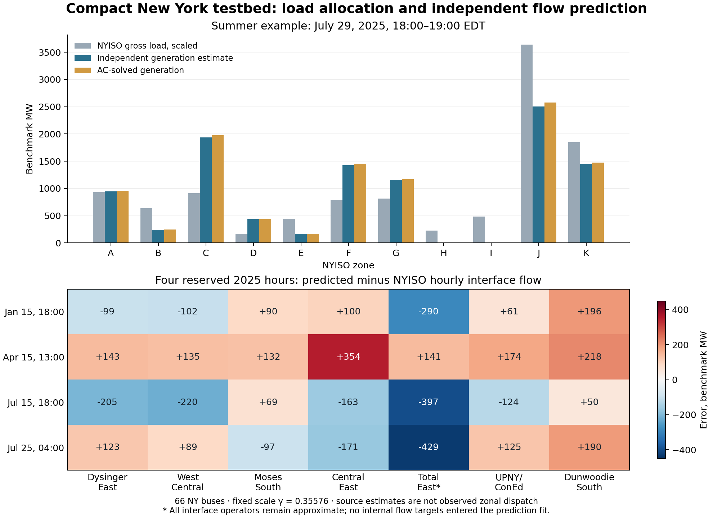

# Independent generation and interface check for the compact New York model

**Current preferred variant:** The separately qualified [71-bus year-end infrastructure baseline](COMPACT_NY_PARTIAL_SPC_BASELINE.md) adds selected late-2025 northern equipment and a new synthetic thermal campaign. This document preserves the 66-bus source experiment and its original four-hour independent comparison.

The 66-bus NPCC-derived case now has a separate operating variant driven by independent public generation estimates. All fourteen hours with qualified input coverage pass bounded AC optimization and fresh power-flow replay. Four calendar-selected hours, reserved before consulting their interface values, have mean absolute interface errors of **134–185 benchmark MW**, with a largest error of **429 MW**. This is a useful preliminary comparison, but it does not establish exact NYISO interface reproduction or observed zonal-dispatch validation.

The network still retains all 46 original NPCC New York buses, 125 branch records (112 active), 37 generator records and ten fixed external injection channels. The old calibrated electrical case and its 23-corridor synthetic thermal campaign remain available. This new electrical operating variant has not yet been substituted into that thermal campaign.



## Load and temporal alignment

Gross zonal loads come from NYISO P58C. One fixed scale per vintage maps the selected summer peak to **10,902.2197987 MW**, while preserving other hours' seasonal demand differences. The 2025 scale is 0.355758660106238. Each of the eleven zonal shares is reproduced by construction; within-zone bus placement and reactive demand remain assumptions. In the selected summer hour, zone J receives 33.383% and K 16.996% of gross demand. This is input accounting, not a prediction of load.

The earlier campaign paired hourly load with a single P32 flow sample. The new variant uses the same hour-beginning window for load, generation and exchanges. A load-only check against P58B covers 8,173 July-2025 zone-hours: the best hour-beginning interpretation has 3.881 MW mean absolute discrepancy, compared with 72.770 MW for hour-ending. This empirically supports the label convention; it does not reveal NYISO's internal integration algorithm. [Time audit](output/compact_ny_2025/generation_sources/time_alignment/time_alignment_summary.csv).

P32 point samples use duration-weighted forward hold, with backward-hold and linear alternatives retained. Repeated rounded-minute labels receive one timestamp mean, with their ranges and source rows retained. A source gap longer than ten minutes invalidates the hour; it is not bridged. Both former S5 snapshots have 11–12-minute gaps and are therefore skipped without replacement. All four new calendar hours have complete boundary and target coverage. The alternative P32 backward convention changes an individual new-hour target by at most 15.31 benchmark MW, so this timing choice alone cannot explain the larger model errors.

Ten scheduled injection channels include separate Cedars and controllable interties. HQ_IMPORT_EXPORT remains excluded from the default sum because of overlapping scope. Landing allocations and zero boundary Q remain assumptions; scheduled regional interchange is not measured individual tie-terminal P/Q.

## Independent generation estimates

No internal interface observations, fitted generation participation or interface-derived zonal balances enter these priors.

1. **Fossil generation geography:** EPA CAMPD supplies uniquely keyed facility/unit/hour records. Source hours use fixed Eastern Standard Time, including summer. Gross output in each clock hour is the reported operating-period MW multiplied once by operating time. This convention is checked against official daily energy records, including 63 partial-operation unit/day comparisons. Missing output remains missing in the source ledger. [EPA source methodology](output/compact_ny_2025/generation_sources/epa/EPA_GENERATION_SOURCE_METHOD.md).
2. **Fossil total:** Covered grid-generation gross shares are normalized to NYISO P63's combined Natural Gas, Dual Fuel and Other Fossil Fuels total. The resulting factors range from 1.005 to 1.146. They reconcile coverage and gross/net differences; they are not measured plant gross-to-net conversion factors. Static fuel labels do not establish the hourly gas/oil split. Institutional Riverbay CHP remains recorded but is excluded from the grid fossil share.
3. **Nuclear:** NRC daily availability times seasonal EIA net capability determines geographic shares, normalized to the statewide hourly nuclear total. Early-morning study hours use the preceding day's NRC report. Daily availability is not hourly electrical output.
4. **Hydro:** Positive monthly EIA conventional-hydro production supplies initial plant estimates. Seasonal plant capability bounds constrain allocation; remaining statewide P63 hydro is assigned over available conventional and pumped-storage headroom. Negative monthly pumped-storage net energy remains visible. This prevents impossible zonal allocations, but does not establish actual hourly pumping, storage energy or dispatch. Blenheim–Gilboa is explicitly assigned to F and Lewiston to A.
5. **Renewables:** Vintage EIA capacities allocate statewide wind; other renewable shares use stated geographic and daylight assumptions. Equal wind capacity factors across sites and imperfect market/behind-meter coverage remain limitations. EIA's 2025 early-release data are retrospective, not an as-of operational forecast.

The source pipeline conserves each statewide fuel total and applies the benchmark scale once. The [combined register](output/compact_ny_2025/generation_sources/combined/zonal_generation_priors.csv) contains all eleven zones for sixteen hours. It is **estimated zonal generation**, not public zonal telemetry.

Cricket Valley and South Fork have separate named priors drawn from those same zonal totals. They are reserved before distributing the remaining zonal estimate among generic NPCC aggregates, preventing double counting and avoiding assignment of fossil-related output to the wind proxy. EIA lists South Fork at 130 MW, while the retained model's project-based limit corresponds to 132 MW; that source discrepancy is explicit.

Each generic generator receives its zone's remaining prior in proportion to available active-power headroom. Existing P/Q limits, loads and network parameters stay fixed. Out-of-range or unrepresented priors are retained in ledgers rather than silently transferred to another zone. AC optimization adjusts dispatch within these bounds to satisfy network physics. Across the nine eligible 2025 hours, absolute zonal departures from the independent estimates average **12.49 MW**, with a maximum **85.02 MW**. This measures adherence to an estimate, not error against observed zonal dispatch.

The historical 2019 comparison retains a significant fleet limitation: approximately 720–747 benchmark MW assigned to zone H, principally Indian Point, has no corresponding generator in the compact parent. The current 2025 H gap is 5.43–11.59 MW. These unallocated amounts are explicit; successful statewide power balance does not erase the geographical mismatch.

## Interface definitions and independent results

The new source-informed operator restores Stolle–Meyer to Dysinger East and West-Central. Total East now measures the modeled A–E to F–K boundary instead of the former F-to-G gate. These changes follow published definitions, not whichever operator minimizes error. Public members, mixed metering locations and selected external contributions remain missing. The [operator audit](COMPACT_INTERFACE_OPERATOR_AUDIT.md) lists every modeled member and unresolved gap.

Methods, source inputs and all saved predictions were frozen before exposing the four new hours' internal flow values. The [freeze manifest](output/compact_ny_2025/generation_sources/methodology_freeze.json) fingerprints 333 dependencies, including the saved AC campaign. Previously inspected hours are called revisited diagnostics, not fresh holdouts.

| Reserved 2025 hour, Eastern | Mean absolute error, benchmark MW | Largest error, benchmark MW |
|---|---:|---:|
| January 15, 18:00 | 133.97 | 289.93 |
| April 15, 13:00 | 185.12 | 354.17 |
| July 15, 18:00 | 175.63 | 397.34 |
| July 25, 04:00 | 174.89 | 429.13 |

Total East has the largest average discrepancy across these hours, 314.35 MW. The source-corrected operator does not improve every hour compared with the former proxy; both are scored on the same fixed solutions. [Full comparison](output/compact_ny_2025/generation_reconstruction/scored_interface_comparison.csv).

The earlier roughly 1–2 MW calibration errors came from fitting interface targets. They are not comparable evidence of independent prediction accuracy. The new four-hour sample is also too small for annual accuracy claims.

## Recent infrastructure: supported additions and a cutoff correction

The selected overlay adds 15 buses and 33 branch records and retires eight predecessor records. It represents CEEC, the NYES Churchtown corridor, the original Smart Path rebuild, and selected NYC receiving/Reliable Clean City paths. Project topology and commissioning evidence are separated from assumed R/X/B, transformer and rating templates. Public project MW benefits are not verified branch MVA ratings.

**The previous blanket exclusion of Smart Path Connect as post-2025 was too broad.** Owner filings show Austin Road–Edic Line 11 energized October 8, Haverstock–Adirondack HA2 October 13, and Adirondack–Austin Road Line 13 November 17, 2025. HA1 and Adirondack–Marcy Line 12 entered service in March 2026. Consequently the retained all-230-kV northern templates are a selected historical approximation, not exact year-end-2025 equipment. Related Dover equipment also entered service in December 2025 and is omitted from the Churchtown-only overlay. [Primary-source status audit and proposed small alternative](output/compact_ny_2025/sources/INFRASTRUCTURE_2025_STATUS_AUDIT.md).

The audit led to a separately implemented and qualified [71-bus partial-SPC alternative](COMPACT_NY_PARTIAL_SPC_BASELINE.md), with independent source priors and its own synthetic thermal campaign. The 66-bus evidence remains preserved. Its original conductor/thermal experiments retain their declared scope; they do not validate newly commissioned physical equipment.

## Reproduction and verified scope

The Python source workflows use Python 3.12, NumPy 2.3.5, pandas 3.0.1 and openpyxl 3.1.5 for the consolidated tests. Original large downloads are cached separately; EPA supports replay from the committed selected source rows. Nonfossil re-extraction requires its public archives, with original and extracted source hashes recorded.

```matlab
replay = replay_compact_generation_reconstruction;  % no optimization or target access
addpath('System Matpower Format');
mpc = npcc_ny_2025_source_generation;               % optional independent S1 case
```

There are **71 passing Python tests**, **43 passing MATLAB method/runner tests**, **eight passing loader guards**, and fourteen fresh AC replays. Every eligible operating point passed on its first MIPS attempt; no IPOPT fallback or capacity relaxation was used. Fresh replay changes dispatch by at most 1.14e-13 MW and interface proxy flow by 7.51e-12 MW. The [campaign summary](output/compact_ny_2025/generation_reconstruction/campaign_summary.csv), [generation deviations](output/compact_ny_2025/generation_reconstruction/zone_generation_deviations.csv), and [replay records](output/compact_ny_2025/generation_reconstruction/independent_replay.csv) preserve separate input, physical, source-estimate and interface qualifications.

To rebuild the experiment, produce hourly load/boundary inputs, EPA and nonfossil sources, combined zonal priors and named subsets; run `run_compact_ny_generation_reconstruction`; independently replay it; then freeze methods and predictions before target extraction and scoring. A saved freeze is never silently overwritten. The optional source-generation loader is electrical only; the original calibrated and synthetic-thermal loaders retain their earlier scope.
