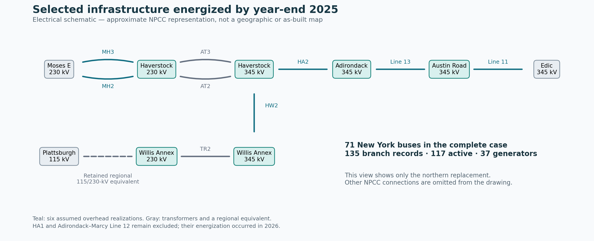

# Compact year-end-2025 northern infrastructure variant

This separate variant updates the northern part of the compact NPCC-derived New York model for selected Smart Path Connect equipment energized during 2025. It has **71 New York buses, 135 branch records, 117 active branches and 37 generator records**, retaining the NPCC benchmark load scale and all 46 original New York bus identities. The previous 66-bus electrical cases, source-generation experiment, and thermal experiment remain reproducible through their original loaders and frozen artifacts.

The operating studies use a fixed December 31, 2025 topology with earlier 2025 demand, scheduled exchanges, and independent generation estimates. They are **counterfactual operating stresses**, not reconstructions of the grid operating on those earlier dates. The relevant interface values were already examined during the previous experiment, so these comparisons are revisited diagnostics and are not new holdouts.

## What determines load, generation and flows

NYISO P58C determines all eleven zonal gross-load totals. One fixed 2025 multiplier, **0.355758660106238**, maps the selected public summer peak of 30,644.9878 MW to **10,902.2197987 MW**. Every zonal load share is preserved; for example, the summer peak has **33.383% in New York City (J)** and **16.996% in Long Island (K)**. Within-zone placement and reactive demand remain declared approximations. No demand is added at the new station sections.

Ten fixed boundary-injection channels represent regional exchanges and separately accounted controllable interties. No surrounding-region buses enter the operating case. Public scheduled interchange determines active injections; landing splits and zero reactive injections are assumptions.

Generation estimates use EPA unit-hour records, NYISO statewide fuel totals, NRC nuclear availability, and EIA capacity/production information. The prior vectors and their uncertainty weights are required to remain exactly equal to the corresponding 66-bus source-generation case. New transmission topology therefore cannot silently change generation geography, increase capability, or change the prior weighting to improve interface agreement. Bounded AC dispatch may depart from the estimates to satisfy power balance and network constraints. These estimates are not observed zonal generation telemetry. [Full source reconstruction](COMPACT_NY_GENERATION_RECONSTRUCTION.md).

Flows follow the resulting AC solution. The source-informed interface operators retain their published-definition rationale and their unresolved coverage gaps. There is no interface-error objective, no fitted line parameter, and no inferred external-flow correction. The original four-hour independent comparison belongs to the frozen 66-bus experiment; its 134–185 MW mean interface errors are not a validation score for this later topology.

## Infrastructure facts and electrical assumptions



The existing selected additions represent CEEC, the NYES Churchtown corridor, and New York City receiving/Reliable Clean City paths. The northern correction distinguishes partial commissioning from full-project completion: Austin Road–Edic Line 11, Haverstock–Adirondack HA2, and Adirondack–Austin Road Line 13 were energized during October–November 2025. HA1 and Adirondack–Marcy Line 12 were energized in March 2026 and remain excluded. Source notices and the NYISO operator reports are recorded separately from model assumptions. [Commissioning audit](output/compact_ny_2025/sources/INFRASTRUCTURE_2025_STATUS_AUDIT.md).

The variant introduces separate Haverstock and Willis Annex voltage sections and an Austin Road section. The added Adirondack station proxy receives an explicit replacement of its old 230-kV role with a 345-kV role; none of the original NPCC bus voltages change. Four previous Smart Path equivalent records and the overlapping Moses–Plattsburgh regional record are retired exactly once. Their historical electrical records remain available, and the replacement ledger distinguishes functional aggregation from a proved physical-device crosswalk.

Project names, voltages, endpoints and commissioning dates do **not** establish R/X/B, transformer impedances, conductor types, or branch MVA limits. For the new northern lines, resistance comes from a declared Drake 795 ACSR surrogate at 75°C and planning route lengths. Historical PERFORM templates supply physical reactance and shunt susceptance per mile, which are then converted to the relevant voltage base. The planning descriptions for HW2 and Lines 11/13 specify ACSS; the ACSR library is an explicit surrogate, not proof of the installed material. Transformer connections have explicit voltage bases and finite ratings. Public project transfer benefits are not treated as individual circuit ratings.

| Added overhead representation | kV | Planning length, miles | Assumed subconductors per phase |
|---|---:|---:|---:|
| Moses–Haverstock MH2 and MH3, each | 230 | 2.0 | 1 |
| Haverstock–Adirondack HA2 | 345 | 83.7 | 2 |
| Haverstock–Willis HW2 | 345 | 35.0 | 2 |
| Austin Road–Edic Line 11 | 345 | 42.5 | 2 |
| Adirondack–Austin Road Line 13 | 345 | 11.6 | 2 |

Each row is one circuit. The new transformers assume own-rating-base R=0.005 pu and X=0.12 pu, nominal taps, and 450/450/1,350 MVA finite ratings. The inherited Plattsburgh 115/230-kV regional equivalent keeps its original series budget and is excluded from thermal realization. All values and source links are in the [branch register](output/compact_ny_2025/partial_spc/partial_spc_branch_register.csv).

The model does not reconstruct every component of the 2025 grid. Remaining omissions include detailed 765-kV equipment, some public flowgate members, local northern circuits represented by an aggregate, and December-2025 Dover equipment outside the selected Churchtown overlay. Future CHPE, the remaining 2026 Smart Path Connect sections, and other later projects are outside this cutoff.

## Validation and use

The study protocol fixes the nominal parameter choices before its numerical comparisons. Nine source-qualified 2025 input hours exercise the nominal topology. A further six summer-peak cases vary impedance to 0.75/1.25, charging to 0/1.5, and finite equipment ratings to 0.8/1.2 of nominal, one parameter family at a time. The input hour with an excessive boundary-data gap remains skipped. These selected sensitivities do not prove feasibility over every joint parameter combination.

Qualification requires bounded AC optimization, a separate power-flow audit with reactive limits enforced, fixed load/boundary/capacity accounting, reconstruction of the exact prior and topology, and saved artifact/code/source fingerprints. Failed attempts remain in the evidence. The new thermal campaign separately checks assumed overhead realizations with synthetic weather, series-current heating, temperature-dependent resistance, and independent electrical/thermal replay. Physical conductor identification and actual weather validation remain outside its scope.

All **15 electrical cases passed**: thirteen on the first MIPS attempt and two through strict IPOPT fallback. The first numerical experiment is retained in `output/compact_ny_2025/partial_spc_initial_solver/`, including its failed night case and original code. Tightening IPOPT convergence controls to 1e-11 resolved the small nodal mismatch while preserving the exact model and objective; neither hardware nor audit tolerances were relaxed. Fresh replay reconstructs every topology and prior and changes dispatch by at most 4.55e-13 MW and interface flow by 9.33e-12 MW. [Electrical results](output/compact_ny_2025/partial_spc/case_summary.csv), [fresh replay](output/compact_ny_2025/partial_spc/independent_replay.csv).

The zonal AC generation totals depart from their independent estimates by a mean absolute **11.44 MW**, with a maximum **77.63 MW**, across the nine nominal hours. This measures agreement with an estimate, not actual zonal generation. The new infrastructure does not resolve the broader interface-definition and network-aggregation gaps:

| Previously exposed calendar hour, Eastern | Mean interface error, benchmark MW | Largest error, benchmark MW |
|---|---:|---:|
| January 15, 18:00 | 133.46 | 289.95 |
| April 15, 13:00 | 184.94 | 353.67 |
| July 15, 18:00 | 175.52 | 397.27 |
| July 25, 04:00 | 171.02 | 470.71 |

Total East remains the weakest comparison, averaging **324.67 MW** absolute error across those four hours. The summer-peak mean interface error is 114.67 MW; across the six declared parameter sensitivities it ranges from 112.13 to 120.57 MW. The nominal parameter choices are retained, independently of which sensitivity happens to match better. [All revisited comparisons](output/compact_ny_2025/partial_spc/revisited_interface_comparison.csv).

All **four synthetic thermal cases passed**, with 121 implementation/physics checks and eight additional replay/adversarial checks. The 25 overhead realizations comprise eleven inherited PERFORM circuits, eight CEEC/NYES equivalents and six northern surrogates. Thermal dispatch changes remain bounded and preserve demand, boundary injections and generator capability.

| Synthetic weather case | Maximum conductor temperature, °C | Total absolute redispatch from electrical reference, MW |
|---|---:|---:|
| Static reference | 75.00 | 216.63 |
| Windy/mild | 49.22 | 1.47 |
| Hot/low wind | 75.00 | 724.57 |
| Cool/windy | 31.76 | 2.54 |

The largest independent heat residual is 0.00951 W/m and the largest electrical-versus-conductor Joule-heating identity error is 7.11e-15 MW. These results establish consistency under the declared surrogate conditions, not actual NYISO DLR benefits or reliability under contingencies. [Thermal operating results](output/compact_ny_2025/partial_spc_thermal/summary.csv), [thermal realizations](output/compact_ny_2025/partial_spc_thermal/realizations.csv).

## Loading and reproducing the baseline

```matlab
addpath('System Matpower Format');
mpc = npcc_ny_2025_partial_spc;  % source-estimated summer input; nominal year-end topology
[mpc_dlr, thermal] = npcc_ny_2025_partial_spc_dlr('static_reference');

electrical_check = replay_compact_2025_partial_spc; % no optimization or target fitting
thermal_check = replay_compact_partial_spc_dlr;    % independent current/heat/AC checks
```

`LATEST_MODEL_CONFIGURATION.csv` selects the 71-bus electrical case as the preferred preliminary candidate. Its thermal qualification is exposed separately. The two 66-bus source/calibrated cases remain available, and the earlier thermal experiment is preserved. Generation-source accounting passes 77 Python tests, including six guards on the new diagnostic scorer. The detailed [infrastructure specification](COMPACT_NY_PARTIAL_SPC_SPECIFICATION.md) records the station choices, exact replacement keys, physical-unit conversions, parameters and known omissions.
