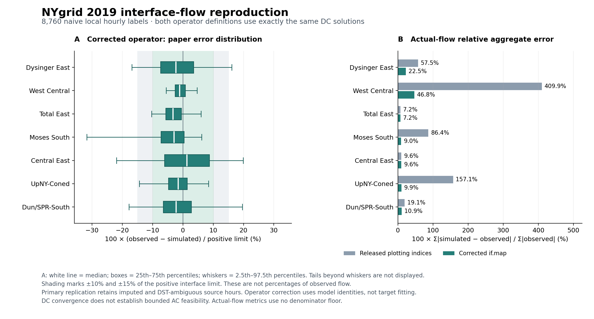

# NYgrid model verification against 2019 NYISO interface data

The released **57-bus NYgrid DC model** was run for all **8,760 prepared local-hour labels in 2019**, giving **61,320 interface comparisons**. Every DC case passed; an independent Python nodal solver reproduces all 94 branch flows to within **1.21e-11 MW**. The case contains 94 AC branch records, four DC-link records, and 271 generator records.

**Five of the seven released plotting formulas use incorrect branch indices.** After correcting measurement using the model's own interface map, the pooled actual-flow weighted absolute error is **11.22%**. Literal execution of the plotting formulas gives **60.66%**. Both measurements use exactly the same solved network and dispatch; no model parameter, generation allocation, or observation target was fitted to obtain the correction.

This verifies the published model/data release with an explicitly documented measurement repair. It does not reproduce Figure 5 through unchanged plotting code, nor establish that the exact undisclosed code/toolbox combination used to generate the paper's figure has been recovered.

## Corrected interface results

Actual-flow weighted error = `100 * sum(abs(simulated - observed)) / sum(abs(observed))`, computed separately for each interface across the year. These are public-system MW, without our compact testbed's NPCC scaling.

| Interface | Mean absolute error, MW | Actual-flow weighted error | Opposite-direction hours |
|---|---:|---:|---:|
| Dysinger East | 209.92 | 22.49% | 77 |
| West Central | 218.46 | 46.81% | 1,006 |
| Total East | 286.53 | 7.24% | 0 |
| Moses South | 152.70 | 8.99% | 9 |
| Central East | 211.80 | 9.63% | 0 |
| UpNY-Coned | 241.12 | 9.91% | 0 |
| Dun/SPR-South | 299.57 | 10.89% | 0 |

The pooled seven-interface mean absolute error is **231.44 MW** and RMSE is **300.09 MW**. Pooled WAPE combines overlapping interface measurements; it is not a statewide energy-balance error. There are **1,092** opposite-direction interface-hours (1.78%), concentrated in West Central.

Pointwise MAPE is **53.43%**. Its denominator can be very small: the minimum observed magnitude is **0.135 MW**. No exactly zero denominators occurred, and no denominator floor was used. WAPE and MAPE therefore answer different questions. [All metrics](output/nygrid_2019/annual_reproduction_interface_metrics.csv).

[Exportable figure PDF](output/nygrid_2019/annual_reproduction_comparison.pdf).

## What the paper's percentages mean

Equation 11 and the released helper use `100 * (observed - simulated) / positive_interface_limit`. Positive error means the simulated signed flow is lower than observed. The code uses the hour's positive limit even for reverse flows, and the negative limit does not enter this metric. Although the paper calls it a rating, the code reads the hourly NYISO limit field; West Central contains **9999 for every hour**, which should not be interpreted as a verified physical transfer rating.

| Interface | Middle 50%, % of positive limit | Empirical central 95%, % of positive limit |
|---|---:|---:|
| Dysinger East | -7.38 to 3.54 | -16.83 to 16.14 |
| West Central | -2.58 to 0.76 | -5.53 to 4.70 |
| Total East | -5.64 to -0.50 | -10.30 to 5.98 |
| Moses South | -7.22 to 0.37 | -31.73 to 6.20 |
| Central East | -6.06 to 8.74 | -21.92 to 19.90 |
| UpNY-Coned | -4.74 to 1.42 | -14.35 to 8.45 |
| Dun/SPR-South | -6.50 to 2.77 | -17.81 to 19.61 |

All seven corrected interquartile intervals are within **-10% to +10% of their positive limits**, consistent with that part of the paper's description. The empirical 2.5th-97.5th percentile ranges are wider than +/-15% for several interfaces, including Central East and Dunwoodie South as well as the hydro-related interfaces. Thus the broader annual accuracy description is only partly reproduced under this explicit quantile definition. Across all comparisons, 84.50% lie within +/-10% and 94.27% within +/-15% of the positive limit. These are not percentages relative to actual flow.

Source: Liu et al., *An Open Source Representation for the NYS Electric Grid to Support Power Grid and Market Transition Studies*, IEEE TPWRS 38(4), 2023, Sections IV-V and Eq. 11, [DOI](https://doi.org/10.1109/TPWRS.2022.3200887); [author-hosted paper](https://sustainable-power-energy-research.media.uconn.edu/wp-content/uploads/sites/3441/2023/11/An-Open-Source-Representation-for-the-NYS-Electric-Grid-to-Support-Power-Grid-and-Market-Transition-Studies.pdf).

## Measurement repair and implementation provenance

The model/data source is [NYgrid commit 47698b6](https://github.com/AndersonEnergyLab-Cornell/NYgrid/tree/47698b6c7823ae7b1bc6935e5601d5b64b8f918e). All 73 acquired code/data files were checked against their upstream Git blob identities. The original source was not modified. The separate read-cache execution copy gives exactly identical bus, branch, generator, DC-link, cost and solved-flow arrays for twelve monthly test hours. [Equivalence evidence](output/nygrid_2019/cache_equivalence.csv).

The endpoint audit constructs directed zone crossings without consulting observed values and compares them with both released definitions. All seven `if.map` definitions match those crossings. Five formulas in [flow4Plot.m](https://github.com/AndersonEnergyLab-Cornell/NYgrid/blob/47698b6c7823ae7b1bc6935e5601d5b64b8f918e/Utility/flow4Plot.m) do not: Dysinger East, West Central, Moses South, UPNY-ConEd, and Dunwoodie South. For example, the plotting UPNY formula includes a C-to-C branch; the corrected map uses the two G-to-H branches. Total East and Central East need no index repair. The complete [branch/end-point ledger](output/nygrid_2019/operator_audit_terms.csv) and [formulas](output/nygrid_2019/operator_audit_formulas.csv) remain available. Matching these modeled zone crossings does not establish exhaustive official NYISO flowgate membership.

The [June 2019 MATPOWER reduction toolbox](https://github.com/MATPOWER/mx-reduction/tree/cbd61ad03308c31faecffa3d8d3259121bdc1aa4) was used locally. The originally linked 2015 archive fails on a legacy interpolation shape issue; a separate compatibility copy replacing only `interp1q` calls with `interp1` gives exactly the same model arrays and flows as the 2019 version for both smoke hours. MATPOWER 8.1's legacy core avoids metadata incompatibilities with the older released case. These software adaptations do not tune electrical data. The exact toolbox version originally used for the paper was not specified. [Toolbox provenance](output/nygrid_2019/toolbox_manifest.json).

## Independent NYISO input verification and limits

All twelve official 2019 P32 archives were retrieved or restored from hash-checked caches: **365 daily CSVs and 1,897,236 rows**. The authors' hourly averaging and interpolation reproduce all **157,680 timestamp/interface keys** for seven internal and eleven scheduled external channels. Maximum numerical discrepancy is **6.37e-12**; the released CSV and actual MAT table match exactly numerically. [Source audit](output/nygrid_2019/nyiso_source_audit.md), [NYISO archive index](https://mis.nyiso.com/public/P-32list.htm).

The primary calculation preserves the authors' naive local-hour preparation. March 10 at 02:00 and December 12 at 12:00 are interpolated; the repeated November daylight-saving hour is combined. Excluding those three ambiguous/interpolated labels leaves 8,757 hours and changes corrected pooled WAPE only to **11.2194%**. Other irregular sample counts and gaps remain documented rather than being silently excluded.

Generation uses the released reconstruction, including 137 matched thermal profiles, a 227-record thermal parameter table, daily nuclear and monthly hydro assumptions, and the code's residual allocation to zone J. Those inputs were not independently rebuilt from every original generation source in this task. This is retrospective DC replay, not a dispatch forecast or independent unit-telemetry validation.

The original DC power-flow method does not enforce equipment or generator bounds. The independent active-flow diagnostic finds at least one positive `RATE_A` exceedance in **8,745 hours**. Solver success therefore does not establish bounded AC, thermal or operational feasibility. These unconstrained DC results must not be compared directly with a bounded AC testbed without matching operating inputs and evaluation rules.

The compact 71-bus model remains unchanged. Its earlier 25.39% result used four 2025 hours and different network/operating assumptions; comparison with this 2019 full-year 11.22% is not a controlled model comparison.

## Reproduction and saved evidence

[Reproduction instructions](scripts/nygrid_2019/README.md) cover pinned downloads, input auditing, source-equivalence checks, four annual runs, independent replay and statistical scoring. All 8,760 states and 61,320 measurements remain in the four annual MAT/CSV partitions under `output/nygrid_2019`. [Independent replay](output/nygrid_2019/independent_dc_replay.json) checks all hours with a separate NumPy/SciPy solver and a 1e-7-MW acceptance threshold; its maximum nodal residual is 1.51e-11 MW. Six source-preparation tests, ten statistical/coverage guards, and the separate DC formula fixtures pass. No hours failed or were omitted from the primary model comparison.
